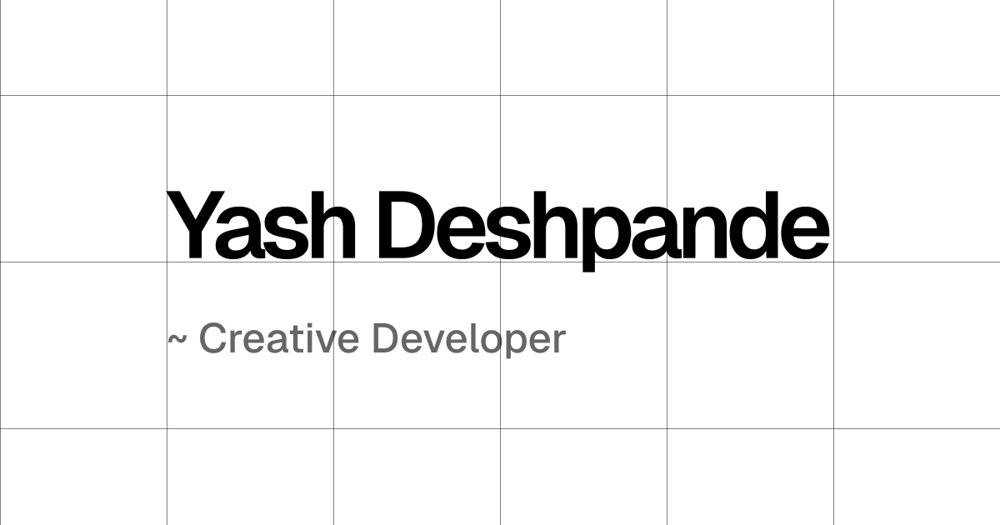

# 🤓 Yash Deshpande — Creative Developer Portfolio (v9)

Welcome to the 9th iteration of my personal portfolio, yes i am this indecisive :)



## ✨ Core Features

- **🌈 Dynamic Theme Spectrum**: A custom sunlight-inspired theme slider (bottom-left sun icon) allowing you to cycle through 17 refined theme states from deep obsidian to pure paper white.
- **📐 Advanced Grid Overlay**: Toggleable design grids (Master, Vertical, and Horizontal) to see the underlying architecture of the layout.
- **⌨️ Keyboard First Navigation**: Power-user shortcuts for almost every interaction on the site.
- **📊 Live GitHub Contributions**: Integrated year-wise contribution graph fetching directly from GitHub API for `yashd-dev`.
- **🎯 Perspective Sections**: Audience-specific hero content for recruiters, designers, and engineers.
- **⚡ Performance Optimized**: Built on Next.js 16 for near-instant transitions and zero-slop UIs.

## 🛠️ Tech Stack

- **Framework**: [Next.js 16](https://nextjs.org/) (App Router)
- **Language**: [TypeScript](https://www.typescriptlang.org/)
- **Styling**: [Tailwind CSS 4](https://tailwindcss.com/)
- **State Management**: React Context (Theme & Grid settings)
- **Deployment**: [Vercel](https://vercel.com/)
- **Package Manager**: [Bun](https://bun.sh/)

## ⌨️ Keyboard Shortcuts

| Key | Action |
|-----|--------|
| `G` | Toggle Master Grid Overlay |
| `V` | Toggle Vertical Grid lines |
| `H` | Toggle Horizontal Grid lines |
| `N` | Navigate to Next Section (wraps around) |
| `S` | Cycle through Theme Spectrum |
| `B` / `W` | Toggle between Black & White themes |
| `Esc` | Close Shortcuts Dialog |

## 📂 Project Structure

- `app/data/content.ts`: **The Content Engine.** All copy, projects, and links are stored here. Modify this to update the site without touching component logic.
- `app/context/ThemeContext.tsx`: The logic behind the theme spectrum and grid system.
- `app/components/GridOverlay.tsx`: The SVG-based animated grid system.
- `app/components/sections/`: Individual section components (Intro, Work, Beliefs, etc.).

## 🚀 Getting Started

1. **Install Dependencies**:
   ```bash
   bun install
   ```

2. **Run Development Server**:
   ```bash
   bun dev
   ```

3. **Build for Production**:
   ```bash
   bun run build
   ```

---
Made with ❤️ by [Yash Deshpande](https://yashd.in)
